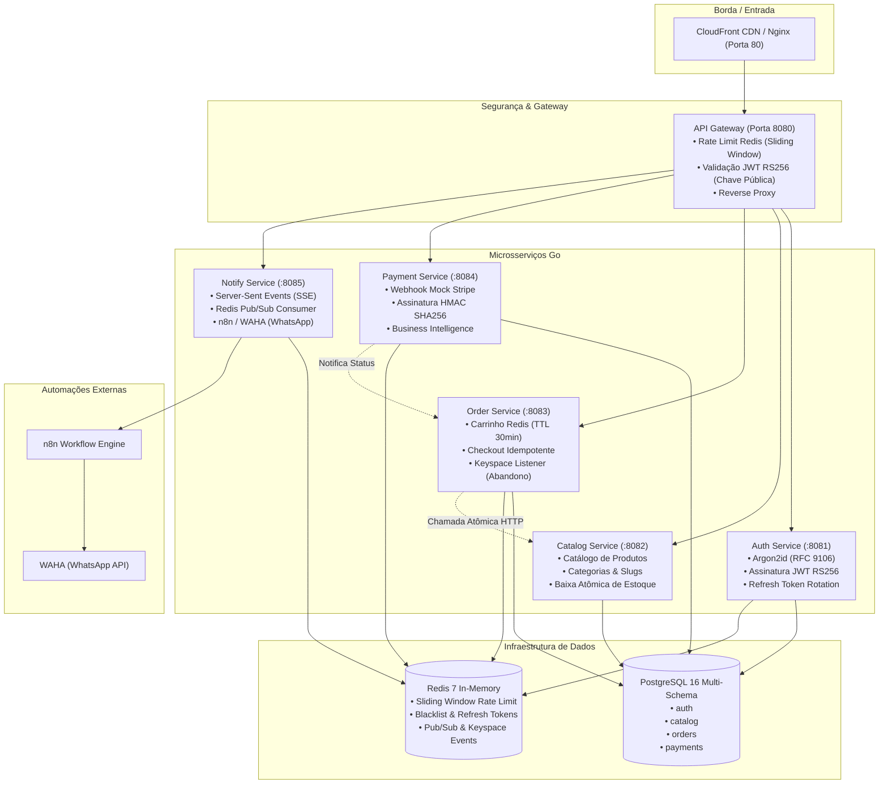

# 🏛️ Arquitetura do Sistema — Commerce-MS

O **Commerce-MS** é uma plataforma distribuída de e-commerce construída em **Go** sob os princípios da **Clean Architecture**, orientada a eventos com **Redis Pub/Sub** e transmissão em tempo real via **Server-Sent Events (SSE)**.

---

## 🗺️ Visão Geral da Arquitetura



---

## 🧩 Clean Architecture em Go

Cada serviço segue rigorosamente o isolamento em 4 camadas concêntricas:

```
services/<nome-servico>/
├── cmd/server/main.go          # Composition Root (injeção de dependências e graceful shutdown)
├── internal/
│   ├── domain/
│   │   ├── entity/             # Structs puras e regras de negócio invariantes
│   │   ├── repository/         # Interfaces e contratos abstratos (sem DB)
│   │   └── service/            # Contratos de serviços de domínio (ex: Hasher, TokenService)
│   ├── usecase/                # Orquestração dos casos de uso (puro Go, 100% testável)
│   ├── infra/
│   │   ├── database/postgres/  # Implementação concreta com pgxpool e SQL parametrizado
│   │   ├── cache/redis/        # Adaptadores Redis (TTL, sliding window, blacklist)
│   │   ├── http/               # Handlers REST e roteamento com Chi
│   │   └── client/             # Clientes HTTP resilientes para comunicação interna
│   └── config/                 # Carregamento de variáveis de ambiente com fallbacks
└── migrations/                 # Scripts SQL de versionamento do schema
```

---

## 🛡️ Destaques de Engenharia & Segurança

### 1. Criptografia de Senhas com Argon2id
- Implementado em conformidade com a **RFC 9106** (`m=65536, t=3, p=2`).
- Gera salts criptográficos aleatórios por usuário.
- Comparação em tempo constante (`subtle.ConstantTimeCompare`) para eliminar qualquer vulnerabilidade a *timing attacks*.

### 2. Autenticação Assimétrica com JWT RS256
- Apenas o `auth-service` possui a **chave privada RSA** para assinar tokens.
- O `gateway` possui apenas a **chave pública RSA** para validar as assinaturas. Mesmo se o gateway for comprometido, um atacante não consegue forjar tokens.
- Tokens revogados no logout entram imediatamente em uma **Blacklist no Redis** consultada em `O(1)`.

### 3. Rate Limiting com Sliding Window (Redis)
- Implementado via Sorted Sets (`ZADD`, `ZREMRANGEBYSCORE`, `ZCARD`).
- Janela deslizante de 60 segundos com limites diferenciados para rotas sensíveis (como `/auth/login`).

### 4. Baixa Atômica de Estoque (Concorrência Segura)
- O checkout executa queries atômicas condicionais:
  ```sql
  UPDATE catalog.products
  SET stock = stock - $2, updated_at = CURRENT_TIMESTAMP
  WHERE id = $1 AND stock >= $2;
  ```
- Garante integridade absoluta sem risco de venda de estoque inexistente (*overselling*).

### 5. Detecção de Carrinho Abandonado em Tempo Real
- O carrinho tem TTL de 30 minutos no Redis.
- O Redis está configurado com `--notify-keyspace-events KEx`.
- Quando o carrinho expira, o `order-service` intercepta o evento, recupera os itens abandonados e publica `cart.abandonado` no Pub/Sub. O `notify-service` despacha o webhook para o **n8n** disparar mensagem de recuperação de vendas no **WhatsApp via WAHA**.

